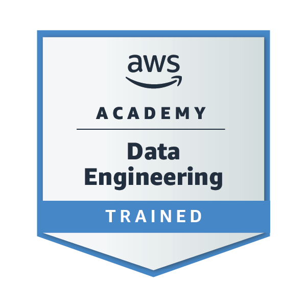
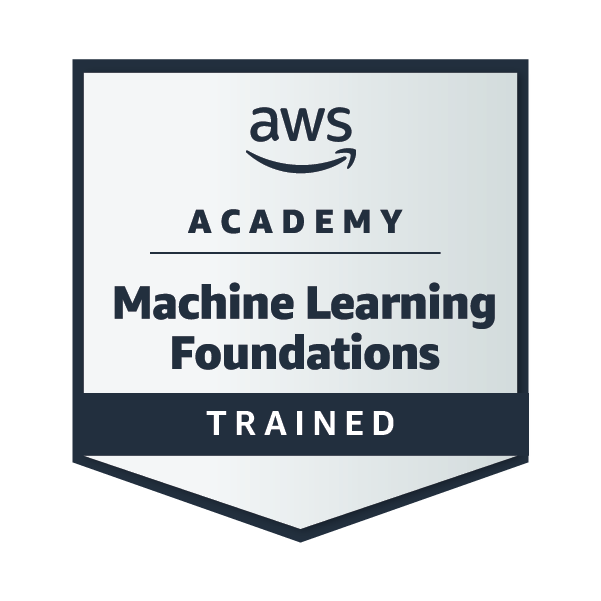

# 💫 About Me:
Software Engineering student at ICEV Focused on back-end development, data engineering, and Artificial Intelligence Interested in building scalable systems, analytics pipelines, and real-world AI applications Currently working on projects involving NLP, Transformers, APIs, and marketing/data analytics

## 🏅 Certifications & Training:

  
  

## 🌐 Socials:

# 💻 Tech Stack:

## 📊 GitHub Stats:
 
 

## 🏆 GitHub Trophies

### ✍️ Random Dev Quote

### 🔝 Top Contributed Repo

---

<!-- Proudly created with GPRM ( https://gprm.itsvg.in ) -->
